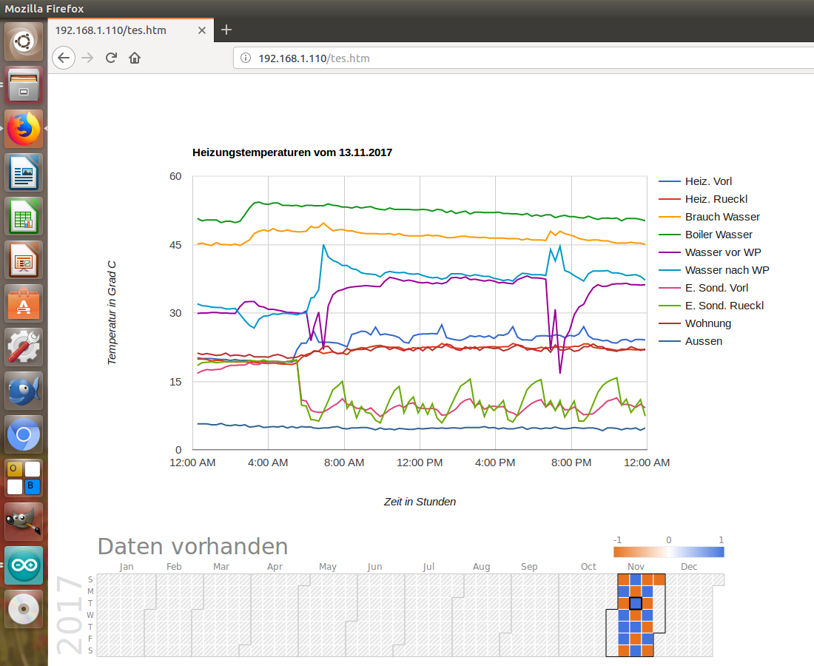
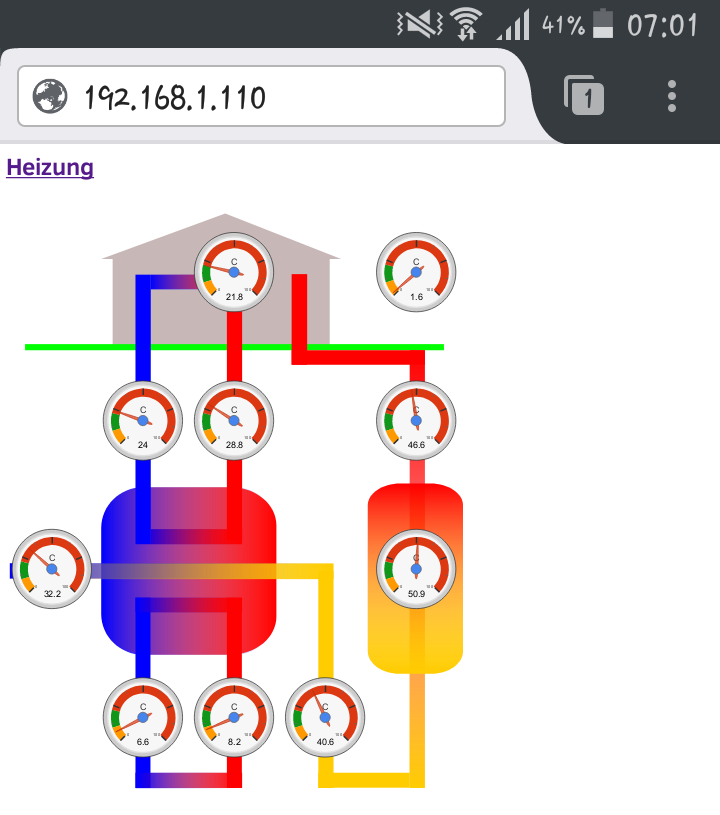
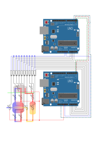

## Willkommen bei Arduino Temperatur Recorder 
Angefangen hat es, dass ich auf der Arduino Seite den ArduinoUnoWifi gesehen haben. Also kann man „einfach“ mit einem SD Schield  einen Temperatur Recorder erstellen, welcher über eine Webseite erreichbar ist. 
Das war die Idee und nach etlichen Tagen und weiterer Hardware ist das Resultat unten sichtbar.

## Folgende Hardware war von Nöten :

  - Microcontroller board, Uno Wi-Fi, A000133, ATmega328P, A000133, Arduino
  
  - Mikrocontroller Board, Uno, A000066, ATmega328, A000066, Arduino
  
  - Schraub-Shield, 103030006, Seeed Studio
  
  - SD-Karten-Shield, 103030005, Seeed Studio
  
  - NTC-Widerstand Perle 30 kOhm, B57551G1303F005, EPCOS
  
  - und diverse Kleinmaterial, Widerstände 30 kOhm, Kabel ...

Das Arduino Uno Wifi Bord wird mit der ESP-link Firmware ausgeliefert. Diese erlaubt keine Kommunikation über das User Datagram Protocol. Somit kann die Zeit nicht über das Network Time Protocol abgefragt werden. Somit muss die Firmware mit der „WiFi Link“ Firmware ausgetauscht werden. 

https://github.com/jandrassy/arduino-firmware-wifilink/blob/ota/UNOWIFI_DEV_ED.md

## Unten ist das Verdrahtungsschema erschlich. Oben der ArduinoUnoWifi, unten der ArduinoUno mit SD Schield.

